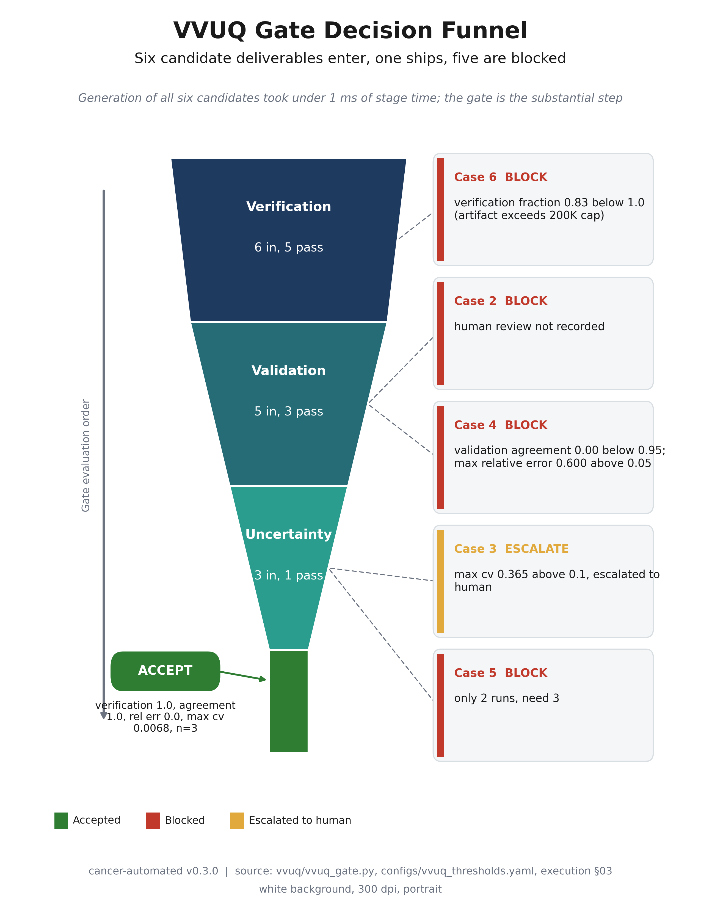
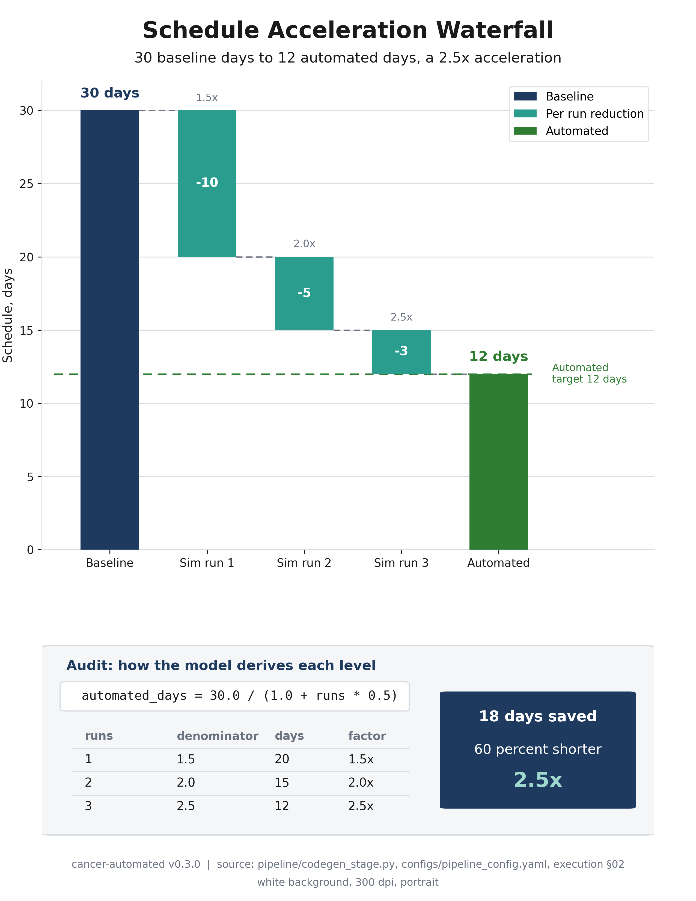
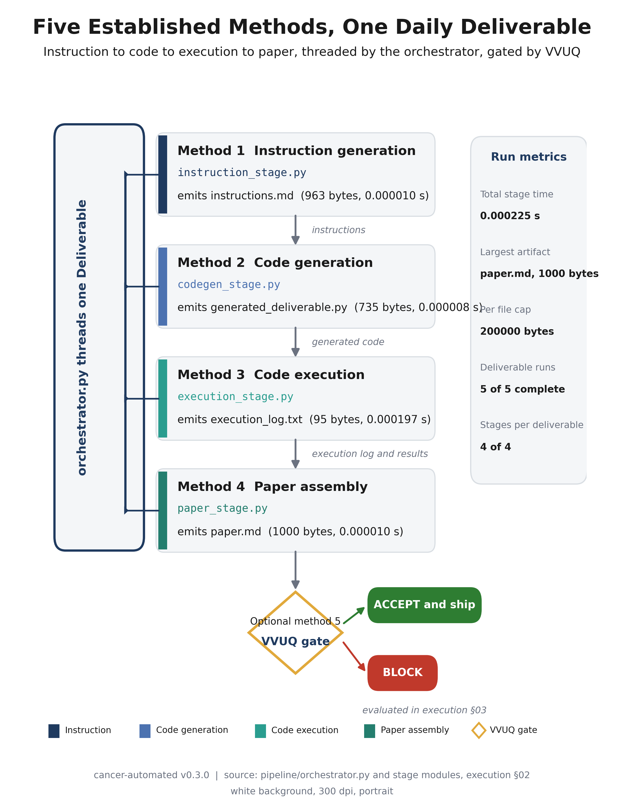
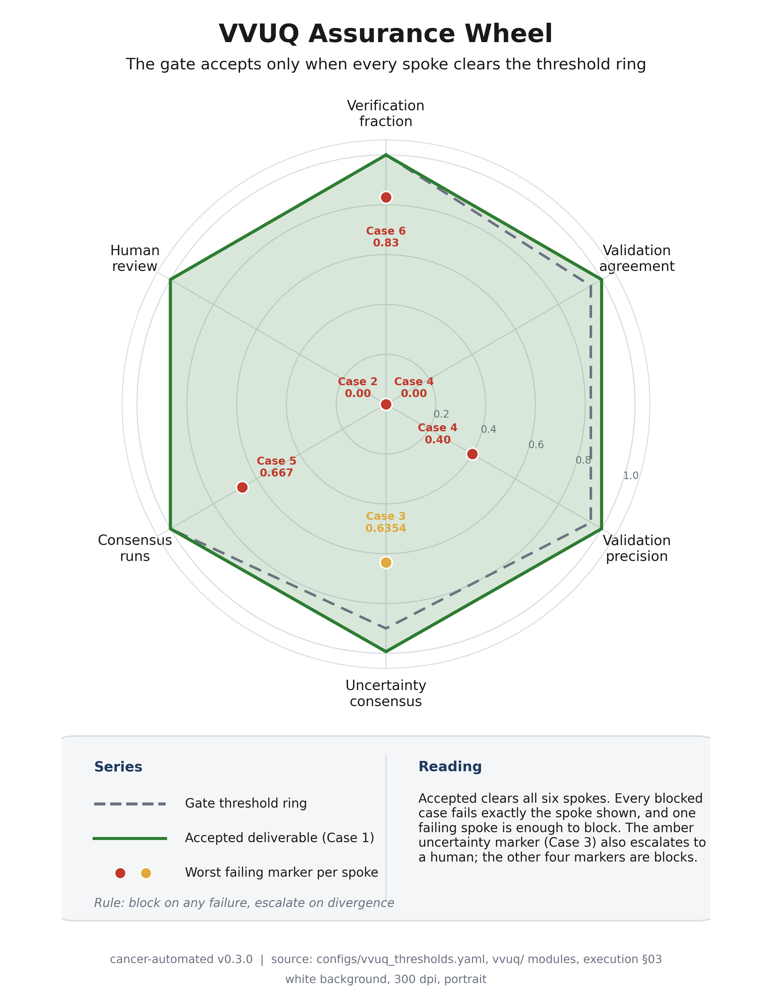
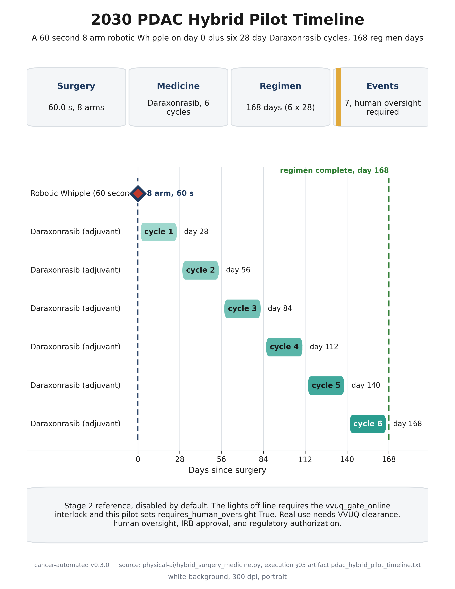
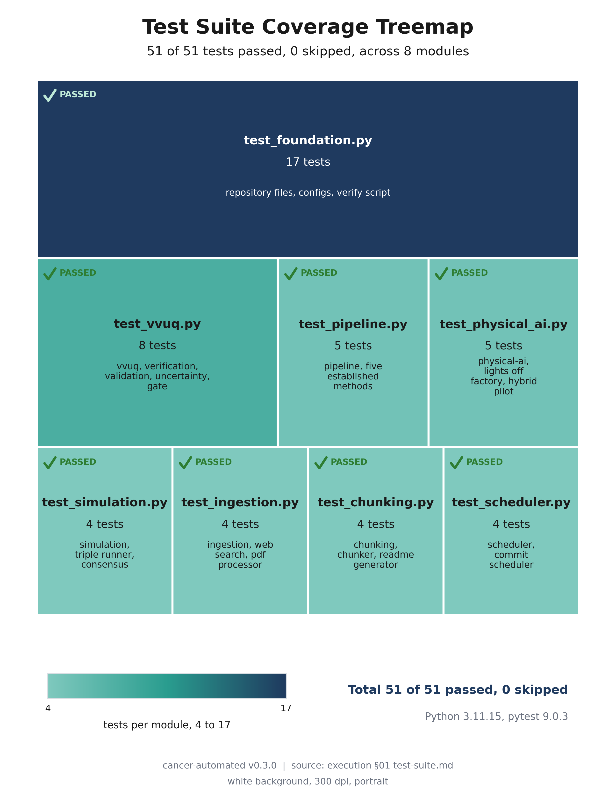
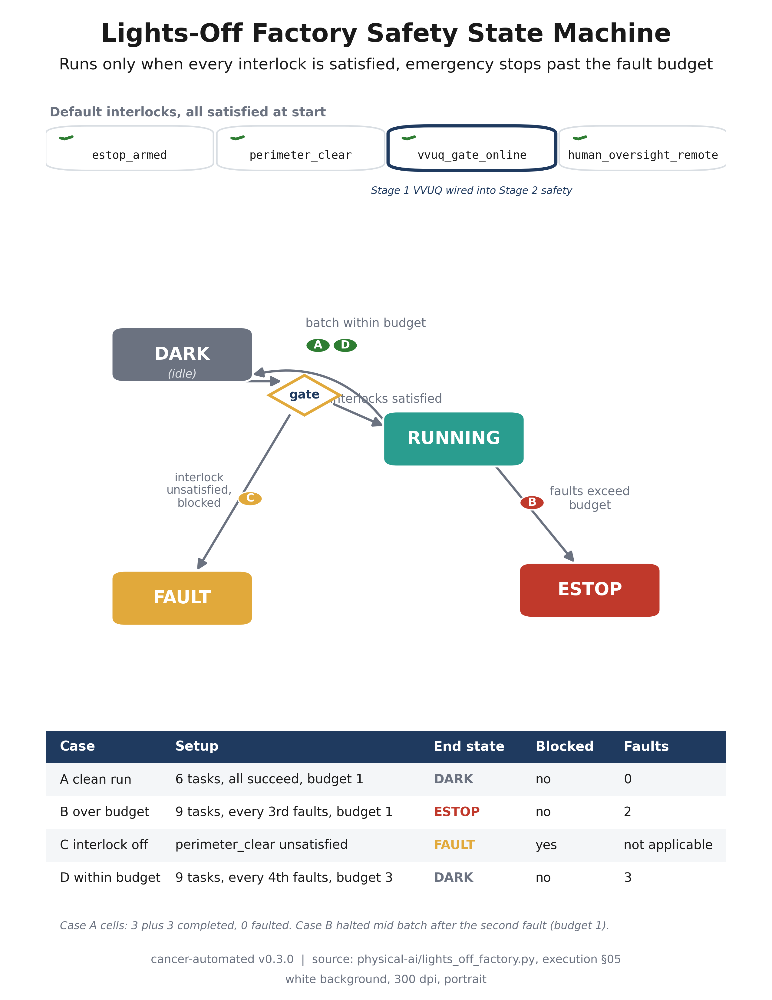
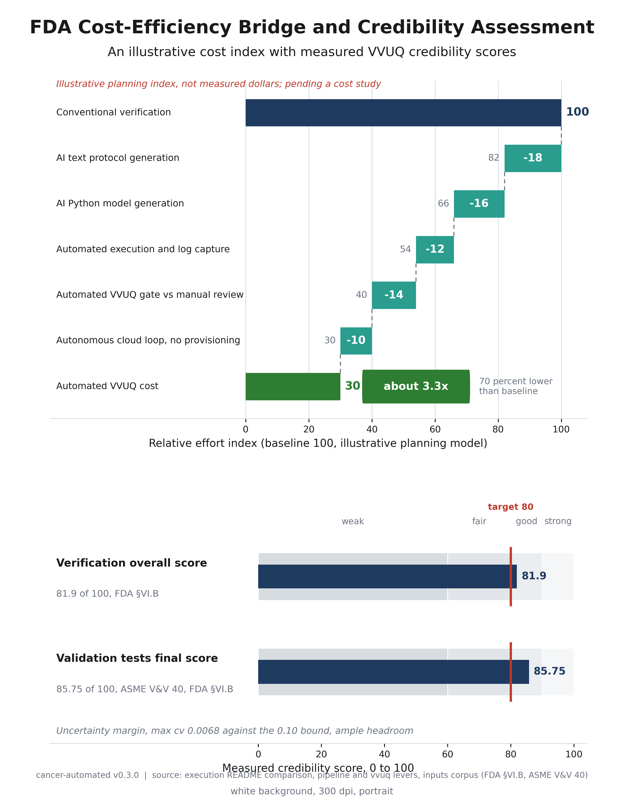
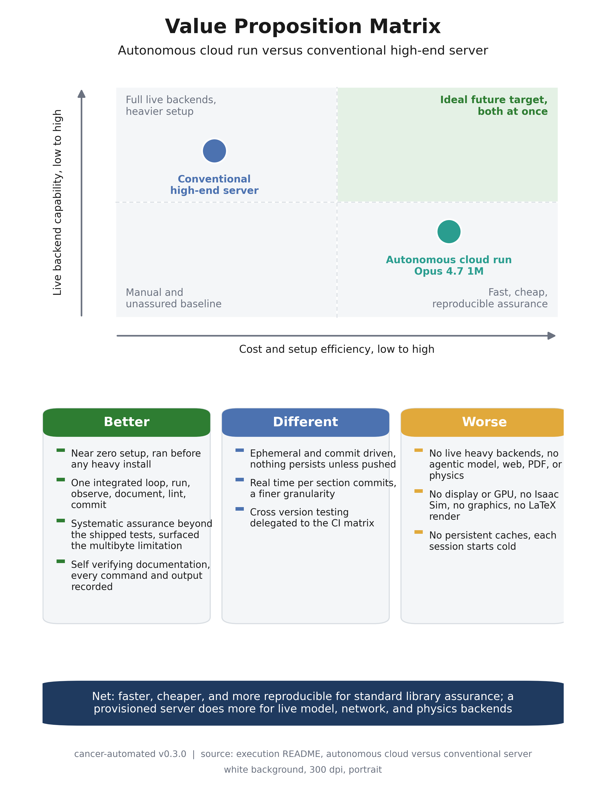
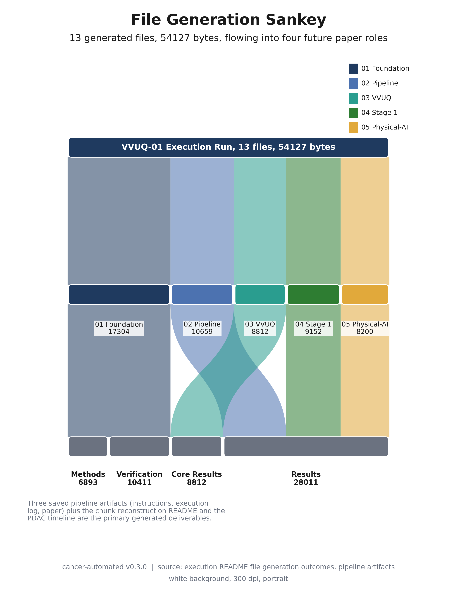

# VVUQ-01 Generated Figures (v0.4.0)

[](../../../LICENSE)
[](../../../releases.md)
[](../../../CHANGELOG.md)
[](https://claude.com/product/claude-code)
[](README.md)
[](README.md)
[](README.md)
[](../../../requirements.txt)

### Update 2026-05-24: The 10 300 DPI images are now available on [Google Drive](https://drive.google.com/drive/folders/1V6VCSZGZZ5xBDQMnyR6Ht_MDXcFpq6lw)


This directory holds the rendered realization of the 10 image specifications in
[`papers/VVUQ-01/image-instruct`](../image-instruct). For each numbered
instruction `NN-name`, this directory carries one self contained matplotlib
script `NN-name/NN-name.py` (the generated code) and the 300 dpi figure
`NN-name/NN-name.png` it produces (the execution output). Every number, label,
and section reference in a figure traces back to a real source file in this
repository, through the code generation record (v0.1.0) and the code execution
record (v0.2.0).

> Scope. The `image-instruct/` directory is the specification. This `imagegen/`
> directory is the build: it contains the matplotlib scripts and the rendered
> PNG files. The figures are portrait, full page (8.5 by 11 inches), saved at
> 300 dpi (2550 by 3300 pixels), on a white background only, with no dark mode.

## Thesis link

The cancer-automated thesis is that the LLM VVUQ process must be more
substantial than the generated artifact itself across code generation, image
generation, and paper generation, accomplished faster and less expensively than
current verification methods. v0.1.0 implemented code generation and paper
generation; v0.2.0 executed and verified them; v0.3.0 specified the figures
ahead of any rendering. This v0.4.0 leg renders those specifications: the
assurance work was front loaded into the instruction, so the build follows the
spec deterministically and a reader needs no manual positioning.

## Generated code versus execution

The instructions emphasize a clean split between authoring code and running it,
the same split the pipeline draws between code generation and code execution.
This directory keeps that split explicit, one to one per figure.

| Artifact | Role | What it is | How it is produced |
|----------|------|------------|--------------------|
| `NN-name/NN-name.py` | generated code | A self contained matplotlib script that hardcodes the grounded values as Python literals, reads no external file, opens no network connection, and sets `matplotlib.use("Agg")` so it renders headless. | Authored from the instruction at `image-instruct/NN-name/README.md`. |
| `NN-name/NN-name.png` | execution output | The portrait, full page, 300 dpi figure, 2550 by 3300 pixels, white background. | Produced by running the script: `python papers/VVUQ-01/imagegen/NN-name/NN-name.py`. |

Each script was authored, then formatted and checked with `ruff`, then executed
to render its PNG, then verified against the per figure acceptance checklist in
its instruction. The scripts depend only on `matplotlib` and `numpy`; `numpy` is
already a core dependency and `matplotlib` is the one added dependency for
rendering.

## The 10 figures

Basis says whether the figure is grounded in code generation (v0.1.0), code
execution (v0.2.0), or both.

| No. | Figure | Chart family | Basis | Script and image |
|-----|--------|--------------|-------|-------------------|
| 01 | VVUQ Gate Decision Funnel | Funnel | both | [`01-vvuq-gate-funnel/`](01-vvuq-gate-funnel) |
| 02 | Schedule Acceleration Waterfall | Waterfall | both | [`02-acceleration-waterfall/`](02-acceleration-waterfall) |
| 03 | Five Established Methods Flowchart | Process flowchart and swimlane | both | [`03-five-methods-flowchart/`](03-five-methods-flowchart) |
| 04 | VVUQ Assurance Wheel | Radar wheel | both | [`04-vvuq-assurance-wheel/`](04-vvuq-assurance-wheel) |
| 05 | 2030 PDAC Hybrid Pilot Timeline | Gantt timeline | both | [`05-pdac-pilot-timeline/`](05-pdac-pilot-timeline) |
| 06 | Test Suite Coverage Treemap | Treemap | execution | [`06-test-coverage-treemap/`](06-test-coverage-treemap) |
| 07 | Lights-Off Factory State Machine | State diagram | both | [`07-lights-off-state-machine/`](07-lights-off-state-machine) |
| 08 | FDA Cost-Efficiency Bridge | Financial bridge and bullet | both | [`08-fda-cost-efficiency-bridge/`](08-fda-cost-efficiency-bridge) |
| 09 | Value Proposition Matrix | Value proposition matrix | execution | [`09-value-proposition-matrix/`](09-value-proposition-matrix) |
| 10 | File Generation Sankey | Sankey flow | both | [`10-file-generation-sankey/`](10-file-generation-sankey) |

None of the figures is a basic bar, pie, or line chart. Where a bar like element
appears (the waterfall, the cost bridge, the credibility bullets) it is part of
a richer, planned composition.

## Figure gallery and grounding

### 01 VVUQ Gate Decision Funnel



Six candidate deliverables enter the gate and one ships. The funnel narrows 6,
5, 3, 1 across verification, validation, and uncertainty, and each drop carries
the verbatim blocking reason. Grounded in `vvuq/vvuq_gate.py`,
`configs/vvuq_thresholds.yaml`, and execution §03.

### 02 Schedule Acceleration Waterfall



The 2.5x acceleration decomposed into the per run reductions 10, 5, 3 days, so
30 baseline days bridges to 12 automated days. The audit panel reproduces the
generated formula `automated_days = 30.0 / (1.0 + runs * 0.5)`. Grounded in
`pipeline/codegen_stage.py`, `configs/pipeline_config.yaml`, and execution §02.

### 03 Five Established Methods Flowchart



One `Deliverable` threaded by the orchestrator through the four producing stages,
each with its module, artifact, byte count, and stage duration, then handed to
the optional fifth method, the VVUQ gate. Grounded in `pipeline/orchestrator.py`
and the stage modules, and execution §02 DAILY-0001.

### 04 VVUQ Assurance Wheel



Six normalized assurance spokes with the gate threshold ring, the accepted
deliverable clearing every spoke, and the worst failing marker per spoke. The
escalated uncertainty marker is amber; the rest are block red. Grounded in
`configs/vvuq_thresholds.yaml`, the `vvuq/` modules, and execution §03.

### 05 2030 PDAC Hybrid Pilot Timeline



A 60 second 8 arm robotic Whipple on day 0 plus six 28 day Daraxonrasib adjuvant
cycles through day 168, 7 timeline events, human oversight required. Grounded in
`physical-ai/hybrid_surgery_medicine.py` and the execution §05 timeline artifact.

### 06 Test Suite Coverage Treemap



51 of 51 tests across 8 modules, each tile area proportional to its test count
(17, 8, 5, 5, 4, 4, 4, 4) with a teal to navy sequential scale and a PASSED
check per tile. Grounded in execution §01 `test-suite.md`.

### 07 Lights-Off Factory State Machine



The DARK, RUNNING, ESTOP, FAULT states with their transitions through the pre run
gate, the four default interlocks (with `vvuq_gate_online` highlighted), and the
four exercised cases. Grounded in `physical-ai/lights_off_factory.py` and
execution §05.

### 08 FDA Cost-Efficiency Bridge



A top illustrative cost bridge cascading the relative effort index 100, 82, 66,
54, 40, 30 (clearly labeled not measured dollars), and a bottom credibility
bullet assessment with the measured Verification 81.9 and Validation 85.75
scores against a target 80 and the FDA §VI.B and ASME V&V 40 references.

### 09 Value Proposition Matrix



A 2 by 2 positioning matrix placing the autonomous cloud run (lower right)
against a conventional high-end server (upper left), with better, different, and
worse summary cards and a net verdict banner. Grounded in the execution README
comparison.

### 10 File Generation Sankey



13 generated files (54127 bytes) flowing from the execution run through the five
sections into the four future paper roles, with ribbon widths proportional to
bytes. 01 Foundation splits into Methods and Verification; the role totals 6893,
10411, 8812, 28011 sum to 54127. Grounded in the execution README file
generation outcomes.

## Shared output conventions

Every figure uses one coherent frame so the set reads as a single publication
ready collection.

- Page frame: portrait, full page, `figure(figsize=(8.5, 11))`, saved with
  `dpi=300` and `facecolor="white"`, giving 2550 by 3300 pixels. No
  `bbox_inches="tight"`, so the full page canvas is preserved.
- Bands: a header band at the top, a content band in the middle, and a footer
  band at the bottom, placed by an explicit `GridSpec` or in axis coordinates, so
  nothing overlaps and the author never has to nudge a box. Long headers,
  subtitles, and footers auto shrink to stay inside the page frame.
- Typography: `DejaVu Sans` (the matplotlib default), dark near black text on
  white for high contrast and legibility.
- Palette: primary navy `#1F3A5F`, slate blue `#4C72B0`, teal `#2A9D8F`, accept
  green `#2E7D32`, block red `#C0392B`, escalate amber `#E1A93B`, neutral gray
  `#6B7280`, panel fill `#F4F6F8`, gridline gray `#D9DEE3`, near black `#1A1A1A`.
- Symbols and dashes: the section symbol renders as `§` where a figure references
  a paper or regulatory section (for example `execution §03` and `FDA §VI.B`),
  never as `SS`. Visible text uses single hyphens only, with no em dashes, en
  dashes, double dashes, or triple dashes. Factors use the `2.5x` style and
  ranges use the word `to`.
- Footer: each figure carries the shared footer with the cancer-automated
  version, its grounding paths, and `white background, 300 dpi, portrait`.

## Reproduction

The scripts use `matplotlib`. The core CI does not install it, and that is fine:
`lint-and-format` runs `ruff` and `yamllint` statically and the `test` job does
not import `imagegen/`, so these scripts keep CI green as long as they stay ruff
clean. Rendering the PNG files needs `matplotlib` installed in the rendering
environment.

```bash
# From the repository root, with matplotlib available (it pulls in numpy).
pip install matplotlib

# Render one figure.
python papers/VVUQ-01/imagegen/01-vvuq-gate-funnel/01-vvuq-gate-funnel.py

# Render all ten figures.
for d in papers/VVUQ-01/imagegen/*/; do
  f="$d$(basename "$d").py"
  [ -f "$f" ] && python "$f"
done

# Confirm the scripts are lint clean (matches the lint-and-format CI job).
ruff check papers/VVUQ-01/imagegen
ruff format --check papers/VVUQ-01/imagegen
```

Each script writes its PNG to its own directory at exactly
`papers/VVUQ-01/imagegen/NN-name/NN-name.png`. Rendering is deterministic: the
same script produces the same 2550 by 3300 pixel image every time.

## Acceptance, as built

Every rendered figure satisfies its instruction checklist: portrait orientation
and full page at 300 dpi; white background only, no dark mode, dark legible text
throughout; header, subtitle, content, legend, and footer inside their bands with
no overlap and no clipping; every number and label traced to a cited source in
this repository; the section symbol rendered as `§` where required and single
hyphens only in visible text; and each script self contained, depending only on
`matplotlib` and `numpy`, passing `ruff check` and `ruff format --check`.

## Responsible use

These figures describe an automated assurance platform and a Stage 2 deployment
reference. They are planning and documentation artifacts. Generated
instructions, code, images, and papers are drafts: a VVUQ gate and a human
reviewer must clear any deliverable before clinical use. The Stage 2 references
require VVUQ clearance, human oversight, IRB approval, and regulatory
authorization before any real use.
